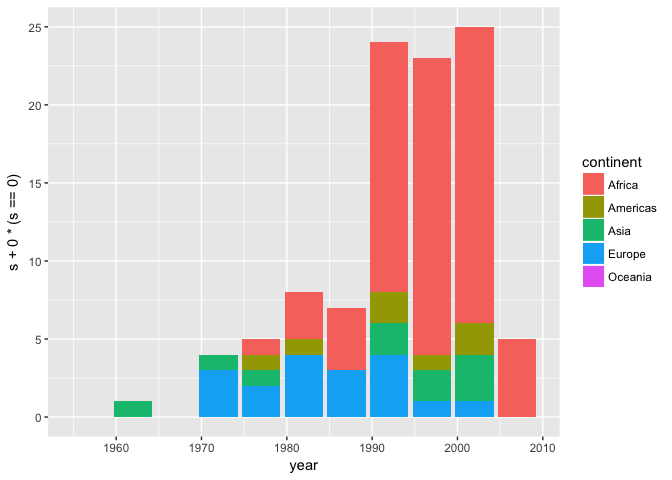

More Gapminder Exploration
================

#### Table of content

-   1 [Installation of packages](#installation_of_packages)

1 Installation of packages
--------------------------

``` r
library(gapminder)
library(tidyverse)
```

    ## Warning: package 'tidyverse' was built under R version 3.2.5

    ## Loading tidyverse: ggplot2
    ## Loading tidyverse: tibble
    ## Loading tidyverse: tidyr
    ## Loading tidyverse: readr
    ## Loading tidyverse: purrr
    ## Loading tidyverse: dplyr

    ## Warning: package 'ggplot2' was built under R version 3.2.5

    ## Warning: package 'tibble' was built under R version 3.2.5

    ## Warning: package 'tidyr' was built under R version 3.2.5

    ## Warning: package 'readr' was built under R version 3.2.5

    ## Warning: package 'purrr' was built under R version 3.2.5

    ## Warning: package 'dplyr' was built under R version 3.2.5

    ## Conflicts with tidy packages ----------------------------------------------

    ## filter(): dplyr, stats
    ## lag():    dplyr, stats

``` r
source('hw3/code/Weighted Quantile.R')
```

We will analyse the gapminder dataset using dplyr and ggplot from tidyverse. We will also be using

Task 1
------

*Report the absolute and/or relative abundance of countries with low life expectancy over time by continent: Compute some measure of worldwide life expectancy – you decide – a mean or median or some other quantile or perhaps your current age. Then determine how many countries on each continent have a life expectancy less than this benchmark, for each year.*

Let's calculate the life 10% percentile life expectancy for the world. To do this, we cannot simly use R's quantile function, as we need weighted quantiles

problem 1: computes the quantile for the first year, and uses that year as the quantile for all years

1.1
---

First of all, lets manipulate the data, and add a field for the 10th percentile for life expectation. As the population of each country varies a lot, the percentile is weighted with the population. Click [here](code/Weighted_Quantile.md) to see how the weighted quantiles are computed. This is a bit technical, but we use the 10th percentile life expectancy with the following definition

*The 10th percentile life expectancy **q**, is such that 10 percent of the continent's population lives in a country with a lower or equal life expectancy than **q**, and 90 percent of the continent's population lives in a country with a higher or equal life expectancy than **q**. *

``` r
gapminder.without.Oceania <- gapminder %>% 
  filter(continent != 'Oceania') %>% # Filter out Oceania as we don't have 
  droplevels()                       # enough observations for computing quantiles
```

    ## Warning: package 'bindrcpp' was built under R version 3.2.5

``` r
# Group by year, such that we can compute the world's 10th percentile life expectation for each year
dat.world <- gapminder.without.Oceania %>%
  group_by(year) %>% 
  mutate(lifeExp.10 = weighted.quantile(lifeExp, weight=as.numeric(pop), probs=0.1))

dat <- gapminder.without.Oceania %>% 
  group_by(continent, year)      %>% # We want to compute the 10th percentile life exp for each continent and each year
  mutate(lifeExp.10 = weighted.quantile(lifeExp, weight=as.numeric(pop), probs=0.1)) %>% 
  ungroup() %>%                      # Add the world's 10th percentile life expectancy
  add_row(continent='World', year=dat.world$year, lifeExp.10=dat.world$lifeExp.10)
```

``` r
dat %>% 
  with(tapply(lifeExp.10, list(continent, year), mean)) %>% 
  knitr::kable()
```

|          |    1952|      1957|      1962|      1967|      1972|      1977|    1982|    1987|    1992|    1997|    2002|    2007|
|----------|-------:|---------:|---------:|---------:|---------:|---------:|-------:|-------:|-------:|-------:|-------:|-------:|
| Africa   |  38.523|  40.42800|  42.64300|  44.79900|  47.04900|  49.35500|  52.961|  54.985|  54.314|  52.199|  49.856|  50.430|
| Americas |  50.917|  53.28500|  55.66500|  57.63200|  59.50400|  61.48900|  63.336|  65.205|  67.057|  69.388|  71.006|  72.390|
| Asia     |  44.000|  50.54896|  44.50136|  58.38112|  63.11888|  63.96736|  65.525|  67.274|  68.690|  70.426|  72.028|  72.961|
| Europe   |  70.780|  71.81000|  72.35000|  72.96000|  73.47000|  74.69000|  74.550|  74.830|  75.700|  77.130|  78.370|  79.313|
| World    |  44.000|  50.54896|  44.50136|  58.38112|  63.11888|  63.96736|  65.525|  67.274|  68.690|  70.426|  72.028|  78.553|

<https://stackoverflow.com/questions/13396662/get-list-of-colors-used-in-a-ggplot2-plot>

``` r
library(scales) # methods for plot scaling
```

    ## Warning: package 'scales' was built under R version 3.2.5

    ## 
    ## Attaching package: 'scales'

    ## The following object is masked from 'package:purrr':
    ## 
    ##     discard

    ## The following object is masked from 'package:readr':
    ## 
    ##     col_factor

``` r
dat %>% 
  ggplot(aes(x=year, color=continent)) + 
  geom_line(aes(y=lifeExp,group=country),alpha=0.1) + 
  geom_line(aes(y=lifeExp.10), size=1) + 
  scale_color_manual(values=c(scales::hue_pal()(5)[1:4], '#000000')) + # Gets ggplot's hue palette, and addes a black color to the palette, then colors the line with the new palette
  labs(title='10th Percentile Life Expectancy', x='Year', y='Life Expectancy')
```


Two observations. First, notice that after 1987, the 10th percentile life expectancy in Africa drops. This does not follow the rest of the world's trend, but can be explained by the outbreak of HIV and Aids. In addition, ovserve that almost all countries lower than the world's 10th percentile life expectation are African.

<https://stackoverflow.com/questions/6999144/how-do-you-create-a-bar-plot-for-two-variables-mirrored-across-the-x-axis-in-r> <https://stackoverflow.com/questions/13734368/ggplot2-and-a-stacked-bar-chart-with-negative-values>

``` r
dat %>% 
  group_by(year,continent) %>% 
  mutate(pop = pop/sum(as.numeric(pop))) %>% 
  group_by(year) %>% 
  mutate(pop.over  = pop*(lifeExp>=lifeExp.10[continent=='World']),
         pop.under = pop*(lifeExp< lifeExp.10[continent=='World'])) %>% 
  filter(continent != 'World') %>% 
  group_by(year,continent) %>%
  summarize(pop.under = sum(pop.under), pop.over = sum(pop.over)) %>% 
  
  ggplot(aes(x=factor(year))) +
  geom_bar(aes(y=pop.under, group=continent, fill=continent), stat='identity', position='stack')
```


``` r
dat %>% 
  group_by(year,continent) %>% 
  mutate(pop = pop/sum(as.numeric(pop))) %>% 
  group_by(year) %>% 
  mutate(pop.over  = pop*(lifeExp>=lifeExp.10[continent=='World']),
         pop.under = pop*(lifeExp< lifeExp.10[continent=='World'])) %>% 
  filter(continent != 'World')
```

    ## # A tibble: 1,680 x 9
    ## # Groups:   year [12]
    ##        country continent  year lifeExp         pop gdpPercap lifeExp.10
    ##         <fctr>    <fctr> <int>   <dbl>       <dbl>     <dbl>      <dbl>
    ##  1 Afghanistan      Asia  1952  28.801 0.006038118  779.4453   44.00000
    ##  2 Afghanistan      Asia  1957  30.332 0.005913136  820.8530   50.54896
    ##  3 Afghanistan      Asia  1962  31.997 0.006052430  853.1007   44.50136
    ##  4 Afghanistan      Asia  1967  34.020 0.006054568  836.1971   58.38112
    ##  5 Afghanistan      Asia  1972  36.088 0.006080720  739.9811   63.11888
    ##  6 Afghanistan      Asia  1977  38.438 0.006240422  786.1134   63.96736
    ##  7 Afghanistan      Asia  1982  39.854 0.004935305  978.0114   65.52500
    ##  8 Afghanistan      Asia  1987  40.822 0.004829986  852.3959   67.27400
    ##  9 Afghanistan      Asia  1992  41.674 0.005207916  649.3414   68.69000
    ## 10 Afghanistan      Asia  1997  41.763 0.006569772  635.3414   70.42600
    ## # ... with 1,670 more rows, and 2 more variables: pop.over <dbl>,
    ## #   pop.under <dbl>

``` r
gapminder %>% 
  mutate(lifeExpChange = lifeExp - lag(lifeExp,1),
         didDecrease = pop*(lifeExpChange<0)) %>% 
  filter(year != min(year)) %>% 
  group_by(continent, year) %>% 
  summarize(s=sum(didDecrease)) %>% 
  ggplot(aes(x=year+2.5, y=s+0.0*(s==0), fill=continent)) + 
  geom_histogram(stat='identity', position='stack') +
  scale_x_continuous(breaks=seq(1952,2007,5))
```

    ## Warning: Ignoring unknown parameters: binwidth, bins, pad


``` r
gapminder %>% 
  mutate(lifeExpChange = lifeExp - lag(lifeExp,1),
         didDecrease = lifeExpChange<0) %>% 
  filter(year != min(year)) %>% 
  group_by(continent, year) %>% 
  summarize(s=sum(didDecrease)) %>% 
  ggplot(aes(x=year, y=s+0.0*(s==0), fill=continent)) + 
  geom_histogram(stat='identity', position='stack')
```

    ## Warning: Ignoring unknown parameters: binwidth, bins, pad



``` r
gapminder %>% 
  mutate(relativePopChange = (pop - lag(pop,1))/pop) %>% 
  filter(year != min(year), abs(relativePopChange) < 0.25) %>% 
  group_by(continent, year) %>% 
  ggplot(aes(x=year, y=relativePopChange, color=continent)) + 
  geom_point(alpha=0.3, aes(size=pop))
```


