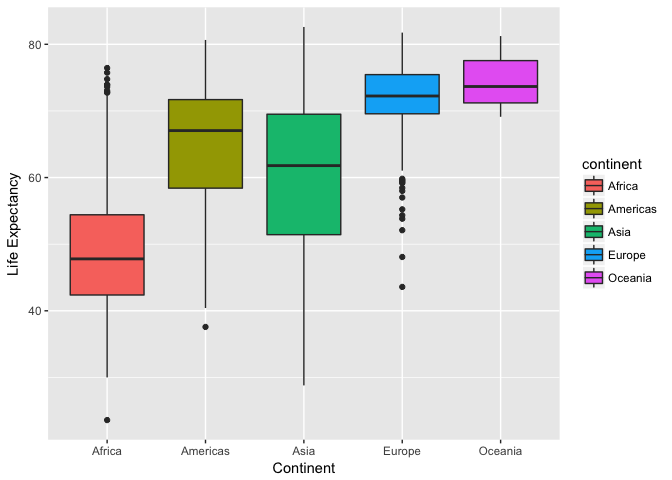

Gapminder Exploration
================

### Abstract

We are going to explore the gapminder data set included with R. We will start with importing the data set, and analyzing what data types the data consists of. Then, we will do some basic visual analisis of the data set using ggplot.

### Table of content

-   [1 Data Set Basics](#data-set-basics)
    -   [1.1 Installation](#installation)
    -   [1.2 Data Types](#data-types)
-   [2 Data Analysis](#data-analysis)
    -   [2.1 Continent](#continent)
    -   [2.2 Life Expectancy](#life-expectancy)
    -   [2.3 Afghanistan and Rwanda](#afghanistan-and-rwanda)

1 Data Set Basics
-----------------

### 1.1 Installation

[*Back to the top*](#abstract)

The gapminder data set is a package in itself, and should therefore be included in the workspace the normal way, i.e.

``` r
library(gapminder)
library(tidyverse)
```

As you might noticed, we also included the tidyverse package. In general, tidyverse is a very useful package and is useful in almost all circumstances. In addition, we need ggplot from the tidyverse later in this exploration, so we might as well include it immediately.

### 1.2 Data Types

[*Back to the top*](#abstract)

To get an understanding of the gapminder dataset it's important to know what data types the dataset exists of.

``` r
str(gapminder)
```

    ## Classes 'tbl_df', 'tbl' and 'data.frame':    1704 obs. of  6 variables:
    ##  $ country  : Factor w/ 142 levels "Afghanistan",..: 1 1 1 1 1 1 1 1 1 1 ...
    ##  $ continent: Factor w/ 5 levels "Africa","Americas",..: 3 3 3 3 3 3 3 3 3 3 ...
    ##  $ year     : int  1952 1957 1962 1967 1972 1977 1982 1987 1992 1997 ...
    ##  $ lifeExp  : num  28.8 30.3 32 34 36.1 ...
    ##  $ pop      : int  8425333 9240934 10267083 11537966 13079460 14880372 12881816 13867957 16317921 22227415 ...
    ##  $ gdpPercap: num  779 821 853 836 740 ...

As one can see, the gapminder data set can be seen as both a tibble and a data frame. I've understood that a tibble class is a "polished" version of the data frame class. Feel free to let me know if otherwise. The data set has 1704 observations of 6 variables. The variables are as follows,

| Variable name | Data type      |
|---------------|----------------|
| country       | Categorical    |
| continent     | Categorical    |
| year          | Integer        |
| lifeExp       | Decimal number |
| pop           | Integer        |
| gdpPercap     | Decimal number |

Note that in R, num is equivalent to double in other languages. There are a lot of ways to disect this data, but I feel that str() gives me what I want. Other ways are

``` r
class(gapminder)
```

    ## [1] "tbl_df"     "tbl"        "data.frame"

``` r
summary(gapminder)
```

    ##         country        continent        year         lifeExp     
    ##  Afghanistan:  12   Africa  :624   Min.   :1952   Min.   :23.60  
    ##  Albania    :  12   Americas:300   1st Qu.:1966   1st Qu.:48.20  
    ##  Algeria    :  12   Asia    :396   Median :1980   Median :60.71  
    ##  Angola     :  12   Europe  :360   Mean   :1980   Mean   :59.47  
    ##  Argentina  :  12   Oceania : 24   3rd Qu.:1993   3rd Qu.:70.85  
    ##  Australia  :  12                  Max.   :2007   Max.   :82.60  
    ##  (Other)    :1632                                                
    ##       pop              gdpPercap       
    ##  Min.   :6.001e+04   Min.   :   241.2  
    ##  1st Qu.:2.794e+06   1st Qu.:  1202.1  
    ##  Median :7.024e+06   Median :  3531.8  
    ##  Mean   :2.960e+07   Mean   :  7215.3  
    ##  3rd Qu.:1.959e+07   3rd Qu.:  9325.5  
    ##  Max.   :1.319e+09   Max.   :113523.1  
    ## 

``` r
head(gapminder,n=1)
```

    ## # A tibble: 1 x 6
    ##       country continent  year lifeExp     pop gdpPercap
    ##        <fctr>    <fctr> <int>   <dbl>   <int>     <dbl>
    ## 1 Afghanistan      Asia  1952  28.801 8425333  779.4453

From the summary function it seems like there are 12 observations from each contry, ranging from 1952 to 2007. Can this be confirmed?

``` r
number.of.observations.per.country <- table(gapminder$country)
var(number.of.observations.per.country)
```

    ## [1] 0

``` r
table(gapminder$year)
```

    ## 
    ## 1952 1957 1962 1967 1972 1977 1982 1987 1992 1997 2002 2007 
    ##  142  142  142  142  142  142  142  142  142  142  142  142

We have already seen that there is 12 observations from at least one coutry. Therefore, when the variance of the number of observations per country is zero, this means that all countries have 12 observations. Further, the last command line shows that for each year there are 142 observations, which is additional evidence.

2 Data Visualization
--------------------

2.1 Continent
-------------

[*Back to the top*](#abstract)

As seen, the continent variable is of type Factor. This means that the values are categorical and the number of data points for each category can be found with the following code

``` r
gapminder %>% 
  select(continent) %>% 
  summary()
```

    ##     continent  
    ##  Africa  :624  
    ##  Americas:300  
    ##  Asia    :396  
    ##  Europe  :360  
    ##  Oceania : 24

Of course, there are not 624 countries in Africa, and the number of countries in the other continents are neither correct. To get the number of countries per continent in the data set, we need to check for a single year instead

``` r
gapminder %>% 
  filter(year==1952) %>% # Extract only the data with year 1952
  select(continent)  %>% # Select the continent
  summary()              # Summarize the data
```

    ## Warning: package 'bindrcpp' was built under R version 3.2.5

    ##     continent 
    ##  Africa  :52  
    ##  Americas:25  
    ##  Asia    :33  
    ##  Europe  :30  
    ##  Oceania : 2

That makes more sense. Note that doing the same for the other 11 years, yields the same result. We can make box plots for each of the continents

``` r
gapminder %>% 
  ggplot(aes(x=continent, y=lifeExp)) +       # Choose variables for x and y axis
  geom_boxplot(aes(fill=continent)) +         # Add a box plot and specify colors
  xlab('Continent') + ylab('Life Expectancy') # Change labels
```



As one can see, the life expectancy data from each continent seems to be very different. In general, Europe and Oceania have higher life expectancies, while Africa and Asia has lower. The variance of the data is also higher when the median is lower. However, the higher variance probably has a lot to with the number of countries in each continent. There could also be a lot of variance from year to year.

``` r
gapminder %>% 
  ggplot(aes(x=factor(year), y=lifeExp)) +      # Choose variables for x and y axis
  facet_grid(~continent) +                      # Create multiple subplots with one continent for each
  geom_boxplot(aes(fill=continent)) +           # Add boxplot
  xlab('Continent') + ylab('Life Expectancy') + 
  theme(axis.text.x = element_text(angle = 90, hjust = 1))
```


There is a lot of movement in the life expectancies for the different continents. In general, the trend is that it's increasing, but it also seems to flatten out when it reaches 70 years.

### 2.2 Life Expectancy

[*Back to the top*](#abstract)

We will now take a look at the life expecancy variable specifically. As seen, the life expecancy is of type decimal number. We can see basic properties of the life expectancy data by using summary after selecting the lifeExp variable.

``` r
gapminder %>% 
  select(lifeExp) %>% 
  summary()
```

    ##     lifeExp     
    ##  Min.   :23.60  
    ##  1st Qu.:48.20  
    ##  Median :60.71  
    ##  Mean   :59.47  
    ##  3rd Qu.:70.85  
    ##  Max.   :82.60

This code finds the 0.00, 0.25, 0.50, 0.75 and 1.00 quantiles and for the life expectancy of the whole data set. It could be interesting to observe how this data changes over time.

<style>
.column-left{
  float: left;
  width: 50%;
  text-align: left;
}
.column-right{
  float: right;
  width: 49%;
  text-align: left;
}
</style>
``` r
gapminder %>% 
  filter(year == 1952) %>% 
  select(lifeExp) %>% 
  summary()
```

    ##     lifeExp     
    ##  Min.   :28.80  
    ##  1st Qu.:39.06  
    ##  Median :45.14  
    ##  Mean   :49.06  
    ##  3rd Qu.:59.77  
    ##  Max.   :72.67

``` r
gapminder %>% 
  filter(year == 2007) %>% 
  select(lifeExp) %>% 
  summary()
```

    ##     lifeExp     
    ##  Min.   :39.61  
    ##  1st Qu.:57.16  
    ##  Median :71.94  
    ##  Mean   :67.01  
    ##  3rd Qu.:76.41  
    ##  Max.   :82.60

As you can see, all quantiles and the mean are greater in 2007 than 1952, indicating a positive development. Click [here](https://stackoverflow.com/questions/31753897/2-column-section-in-r-markdown) if you would like to know how the two column code was made. It uses CSS code but is easy to understand if you have some programming knowledge.

It could also be nice to have some visualizations of the data. An estimation of the distribution of the life expectancy is plotted below. Several distributions are plotted over time, but to limit the number of distributions, we plot for each decade, not year.

``` r
gapminder %>% 
  mutate(decade = factor(10*floor(year/10),
                         labels=c('50s',
                                  '60s',
                                  '70s', 
                                  '80s', 
                                  '90s', 
                                  '00s'))) %>%  # Create a new variable with the decade
  ggplot(aes(x=lifeExp)) +                      # Choose variables for x axis
  geom_density(aes(fill=decade,                
                   color=decade), alpha=0.05) + # Add density plot colored by decade
  xlim(20,90) + xlab("Life Expectancy") + ylab("Estimated Density")
```


Note that when specifying the colors, I forced the year to be a factor variable. This is because ggplot has a very pretty default color palette for factors, which works great with discretized variables (like decades).

The trend of countries increasing their life expectancy is quite obvious. Still, even with decades only, the plot is somewhat chaotic. Let's instead focus on the first and last year of observation

``` r
gapminder %>% 
  filter(year %in% c(max(year), min(year))) %>% # Extract only the extremas of year
  ggplot(aes(x=lifeExp)) +                      # Choose variables for x axis
  geom_density(aes(fill=factor(year), 
                   color=factor(year)),         # Add density plot colored by decade
               alpha=0.05) + 
  xlim(20,90) + ylim(0,0.045) + xlab("Life Expectancy") + ylab("Estimated Density")
```


Based on the the previous plot, this plot was not unexpected. However, these plots can be misinterpreted. The distributions are estmated based on occurances per year, meaning the life expectancy of small countries like Norway is weighted the same as that of large countries as China. To coupe with this we could try to weight the data based on population.

``` r
gapminder %>% 
  filter(year %in% c(max(year), min(year))) %>% # Extract only the extremas of year
  ggplot(aes(x=lifeExp)) +                      # Choose variables for x axis
  geom_density(aes(weight=pop,
                   fill=factor(year), 
                   color=factor(year)),         # Add density plot weighted by population
               alpha=0.05) + 
  xlim(20,90) + xlab("Life Expectancy") + ylab("Estimated Density")
```


This did not work. As you can see, the distribution surely doesn't integrate to 1, and the total weight of the distribution is much larger for 2007 than 1952. We clearly need a proportional population variable, which sums to 1 for each year. This can be done in the following way

``` r
p <- gapminder %>% 
  filter(year %in% c(max(year), min(year))) %>%  # Extract only the extremas of year
  group_by(year) %>%                             # Group all data points with same year together
  mutate(pop.density = pop/sum(as.numeric(pop))) # New variable with the proportional population for each year
  
p %>% 
  ggplot(aes(x=lifeExp)) + 
  geom_density(aes(weight=pop.density, 
                   fill=factor(year), 
                   color=factor(year)), alpha=0.05) + 
  xlim(20,90) + xlab("Life Expectancy") + ylab("Estimated Density")
```


Adding group\_by(year) makes sum(as.numeric(pop)) sum over each year. Therefore, the elements of pop.density for a given year now sums to one. This can also be confirmed by

``` r
p %>% 
  group_by(year) %>% 
  summarize(sum.pop.density = sum(pop.density))
```

    ## # A tibble: 2 x 2
    ##    year sum.pop.density
    ##   <int>           <dbl>
    ## 1  1952               1
    ## 2  2007               1

Further, one can plot the quantiles of the life expecancy. Below, lines for life expectancy, the median and a quantile based 80% confidence interval is plotted.

``` r
p2 <- gapminder %>% 
  group_by(year) %>%
  mutate(q.1 = quantile(lifeExp,0.1),    
         q.5 = quantile(lifeExp,0.5),
         q.9 = quantile(lifeExp,0.9)) %>% # Compute median and 0.1 and 0.9 quantiles
  ggplot(aes(x=year))                     # Choose variable for x axis

p2 + 
  geom_line(aes(y=lifeExp, group=country), alpha=0.1) + # Plot one line for each country
  geom_ribbon(aes(ymin=q.1, ymax=q.9),alpha=0.5) +      # Add ribbon for a quantile based 80% conf.int.
  geom_line(aes(y=q.5),size=0.5,color='red') +          # Add line plot of the median
  xlab("Year") + ylab("Life Expectancy")
```


As one can see, the median life expecancy is increasing much faster than the 10 and 90 percent quantiles. This indicates that there is not much to gain once you have a high life expectancy, and there still are countries struggeling with increasing their life expectancy. Also observe the two outliers for life expectancies in 1977 and 1992. From which countries are they recorded?

``` r
gapminder %>% 
  filter(year==1977) %>%            # Select the year we are interested in
  filter(lifeExp==min(lifeExp)) %>% # Extract the data point with the minimum life Expectancy
  select(country)
```

    ## # A tibble: 1 x 1
    ##    country
    ##     <fctr>
    ## 1 Cambodia

``` r
gapminder %>% 
  filter(year==1992) %>%            # Select the year we are interested in
  filter(lifeExp==min(lifeExp)) %>% # Extract the data point with the minimum life Expectancy
  select(country)
```

    ## # A tibble: 1 x 1
    ##   country
    ##    <fctr>
    ## 1  Rwanda

Brutally enough, these datas matches the genosides in Cambodia and Rwanda in given time spans quite well.

2.3 Afghanistan and Rwanda
--------------------------

[*Back to the top*](#abstract)

So someone tried to extract the data from Afghanistan and Rwanda with the following code.

``` r
filter(gapminder, country == c("Rwanda", "Afghanistan"))
```

    ## # A tibble: 12 x 6
    ##        country continent  year lifeExp      pop gdpPercap
    ##         <fctr>    <fctr> <int>   <dbl>    <int>     <dbl>
    ##  1 Afghanistan      Asia  1957  30.332  9240934  820.8530
    ##  2 Afghanistan      Asia  1967  34.020 11537966  836.1971
    ##  3 Afghanistan      Asia  1977  38.438 14880372  786.1134
    ##  4 Afghanistan      Asia  1987  40.822 13867957  852.3959
    ##  5 Afghanistan      Asia  1997  41.763 22227415  635.3414
    ##  6 Afghanistan      Asia  2007  43.828 31889923  974.5803
    ##  7      Rwanda    Africa  1952  40.000  2534927  493.3239
    ##  8      Rwanda    Africa  1962  43.000  3051242  597.4731
    ##  9      Rwanda    Africa  1972  44.600  3992121  590.5807
    ## 10      Rwanda    Africa  1982  46.218  5507565  881.5706
    ## 11      Rwanda    Africa  1992  23.599  7290203  737.0686
    ## 12      Rwanda    Africa  2002  43.413  7852401  785.6538

It would seem like the extraction worked. However, notice that there are only 12 data points, while it should be 24. As one can see, only the data with year ending with 7 is from Afghanistan while only the data with year ending with 2 is from Rwanda. So why is this? The statement

``` r
country == c("Rwanda", "Afghanistan")
```

tries to compare two vectors of different lengths. This is done by repeating the right side until it has the same length as the right side. Therefore, the code will only include a data point, if its index is odd and its country is Rwanda, or if its index is even and its country is Afghanistan. The correct way to extract all data points from Rwanda and Afghanistan would be to use the %in% operator.

``` r
filter(gapminder, country %in% c("Rwanda", "Afghanistan"))
```

    ## # A tibble: 24 x 6
    ##        country continent  year lifeExp      pop gdpPercap
    ##         <fctr>    <fctr> <int>   <dbl>    <int>     <dbl>
    ##  1 Afghanistan      Asia  1952  28.801  8425333  779.4453
    ##  2 Afghanistan      Asia  1957  30.332  9240934  820.8530
    ##  3 Afghanistan      Asia  1962  31.997 10267083  853.1007
    ##  4 Afghanistan      Asia  1967  34.020 11537966  836.1971
    ##  5 Afghanistan      Asia  1972  36.088 13079460  739.9811
    ##  6 Afghanistan      Asia  1977  38.438 14880372  786.1134
    ##  7 Afghanistan      Asia  1982  39.854 12881816  978.0114
    ##  8 Afghanistan      Asia  1987  40.822 13867957  852.3959
    ##  9 Afghanistan      Asia  1992  41.674 16317921  649.3414
    ## 10 Afghanistan      Asia  1997  41.763 22227415  635.3414
    ## # ... with 14 more rows
