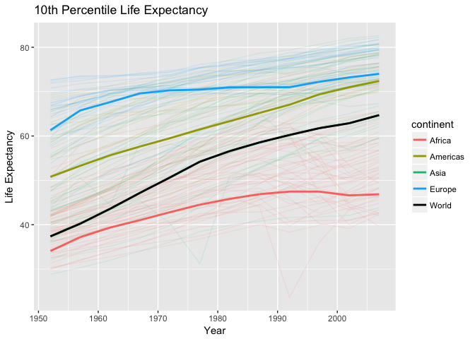
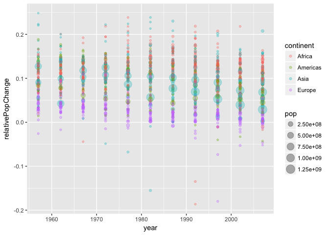
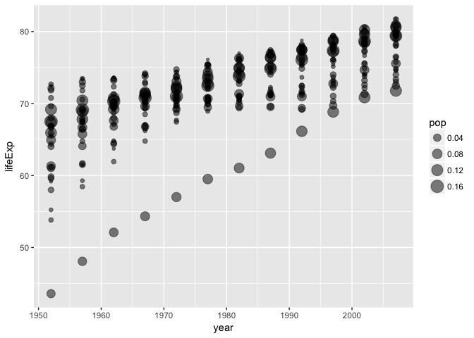

More Gapminder Exploration
================

#### Table of content

-   1 [Installation of packages](#installation_of_packages)

<style>
.column-left{
  float: left;
  width: 50%;
  text-align: left;
}
.column-right{
  float: right;
  width: 49%;
  text-align: left;
}
</style>
1 Installation of packages
--------------------------

``` r
library(gapminder)
library(tidyverse)
library(scales) 
source('code/Weighted Quantile.R')
```

We will analyse the gapminder dataset using dplyr and ggplot from tidyverse. We will also be using ggplots hue palette obtained from the scales library, and a custom made weighted quantile function. The documentation for the weighted quantiles function can be found in the

Task 1
------

*Report the absolute and/or relative abundance of countries with low life expectancy over time by continent: Compute some measure of worldwide life expectancy – you decide – a mean or median or some other quantile or perhaps your current age. Then determine how many countries on each continent have a life expectancy less than this benchmark, for each year.*

Let's calculate the life 10% percentile life expectancy for the world. To do this, we cannot simly use R's quantile function, as we need weighted quantiles

problem 1: computes the quantile for the first year, and uses that year as the quantile for all years

2 Fun with Data
---------------

#### 2.1 20th Percentile Life Expectancy

First of all, lets manipulate the data, and add a field for the 20th percentile for life expectation (abbreviated 20th percentile from now on). As the population of each country varies a lot, the percentile is weighted with the population. Click [here](code/Weighted_Quantile.md) to see how the weighted quantiles are computed. This is a bit technical, but we use the 20th percentile with the following definition

> The 20th percentile *q*, is such that 10 percent of the continent's population lives in a country with a lower or equal life expectancy than *q*, and 90 percent of the continent's population lives in a country with a higher or equal life expectancy than *q*.

``` r
# Start with the gapminder dataset
gapminder <- gapminder %>% 
  
# filter out Oceania as we don't have enough observations for computing quantiles
  filter(continent != 'Oceania') %>% 
  
# continent is a factor variable, and droplevels() makes sure that Oceania is removed as an option
  droplevels()                       
```

``` r
# compute the 20th percentile for each continent and each year
percentile.data <- gapminder %>% 
  group_by(continent, year)      %>% 
  summarize(lifeExp = weighted.quantile(lifeExp, weight=as.numeric(pop), probs=0.2)) %>% 
  
  
# and add the world's 20th percentile to the data  
  full_join(gapminder %>%
              group_by(year) %>% 
              summarize(continent = 'World', 
                        lifeExp = weighted.quantile(lifeExp, weight=as.numeric(pop), probs=0.2)))
```

    ## Joining, by = c("continent", "year", "lifeExp")

We use kable to display the data we just created

``` r
percentile.data %>% 
  
# spread the 20th percentile on a table with continent rows and year columns
  spread(key=year, value=lifeExp) %>% 
  
# and present the data
  knitr::kable(digits=1)
```

| continent |  1952|  1957|  1962|  1967|  1972|  1977|  1982|  1987|  1992|  1997|  2002|  2007|
|:----------|-----:|-----:|-----:|-----:|-----:|-----:|-----:|-----:|-----:|-----:|-----:|-----:|
| Africa    |  34.1|  37.2|  39.4|  41.0|  42.8|  44.5|  45.8|  46.9|  47.5|  47.5|  46.6|  46.9|
| Americas  |  50.8|  53.3|  55.7|  57.6|  59.5|  61.5|  63.3|  65.2|  67.1|  69.4|  71.0|  72.4|
| Asia      |  37.4|  40.2|  43.6|  47.2|  50.7|  54.2|  56.6|  58.6|  60.2|  61.8|  62.9|  64.7|
| Europe    |  61.3|  65.8|  67.6|  69.6|  70.3|  70.5|  71.0|  71.0|  71.0|  72.2|  73.2|  74.0|
| World     |  37.4|  40.2|  43.6|  47.2|  50.7|  54.2|  56.6|  58.6|  60.2|  61.8|  62.9|  64.7|

And this data is plotted, together with the life expectancy for each country.

``` r
# plot the life expectancy for each year
ggplot(gapminder,aes(x=year, y=lifeExp, color=continent)) + 
  geom_line(alpha=0.1,
            aes(group=country)) +

# add the continent wise 20th precentile
  geom_line(data=percentile.data,
            size=1,
            aes(linetype=(continent=='World'))) + 

# add color with chroma=65, luma=100 but different hue for the different continents, and black color for the world
  scale_color_manual(values=c(hcl(h=15+seq(0,3)*360/5,c=100,l=65), 'black'), 'Continent') +
  
# add title and axis labels
  labs(title='20th Percentile Life Expectancy', x='Year', y='Life Expectancy')
```



This plot tells us alot. We might just have to explore this plot.

#### 2.1.1 Asia and the World

Notice how the 20th percentile is the very same for Asia and for the World. This cannot be coincidental. The 20th percentile is defined on a non-interpolating manner, so each 20th percentile belongs to the life expectancy of one country. The country might differ from year to year, but it's worth checking. Consider the two largest countries in Asia, China and India.

``` r
asia.and.the.world.data <- 
  percentile.data %>% 
  mutate(country=continent) %>% 
  full_join(gapminder) %>% 
  filter(country %in% c('China','India','World'))%>% 
  select(year, country, lifeExp) 
```

    ## Joining, by = c("continent", "year", "lifeExp", "country")

    ## Warning: Column `continent` joining character vector and factor, coercing
    ## into character vector

    ## Warning: Column `country` joining character vector and factor, coercing
    ## into character vector

    ## Adding missing grouping variables: `continent`

``` r
asia.and.the.world.data %>% 
  spread(key=year,value=lifeExp) %>% 
  knitr::kable(digits=1)
```

| continent | country |  1952|  1957|  1962|  1967|  1972|  1977|  1982|  1987|  1992|  1997|  2002|  2007|
|:----------|:--------|-----:|-----:|-----:|-----:|-----:|-----:|-----:|-----:|-----:|-----:|-----:|-----:|
| Asia      | China   |  44.0|  50.5|  44.5|  58.4|  63.1|  64.0|  65.5|  67.3|  68.7|  70.4|  72.0|  73.0|
| Asia      | India   |  37.4|  40.2|  43.6|  47.2|  50.7|  54.2|  56.6|  58.6|  60.2|  61.8|  62.9|  64.7|
| World     | World   |  37.4|  40.2|  43.6|  47.2|  50.7|  54.2|  56.6|  58.6|  60.2|  61.8|  62.9|  64.7|

Due to its size, India is in some sence determining the 20th percentile. But why is the 20th percentile 100% correlated with India? One way to understand this is in terms of population size. Let's compute the relative populations of China and India

``` r
relative.pop <- gapminder %>% 
  group_by(year) %>% 
  summarize(China = pop[country=='China']/sum(as.numeric(pop)),
            India = pop[country=='India']/sum(as.numeric(pop)),
            World = 1-China-India)

relative.pop %>% 
  knitr::kable(digits = 2)

gapminder %>% 
  mutate(country = factor(country=='China'))
```

|      |  China|  India|  The rest of the world|
|------|------:|------:|----------------------:|
| 1952 |   0.23|   0.16|                   0.61|
| 1957 |   0.24|   0.15|                   0.61|
| 1962 |   0.23|   0.16|                   0.61|
| 1967 |   0.24|   0.16|                   0.61|
| 1972 |   0.24|   0.16|                   0.60|
| 1977 |   0.24|   0.16|                   0.60|
| 1982 |   0.23|   0.17|                   0.60|
| 1987 |   0.23|   0.17|                   0.60|
| 1992 |   0.23|   0.17|                   0.60|
| 1997 |   0.22|   0.17|                   0.60|
| 2002 |   0.22|   0.18|                   0.61|
| 2007 |   0.21|   0.18|                   0.61|

    ## Warning: Ignoring unknown parameters: binwidth, bins, pad


As one can see, China and India has roughly 40% of the world's population. Therefore, for a random year, it's a 40% probability that the quantile corresponding to a randomly chosen percentile falls in either China or India. Considering tat different countries has very correlated life expectancies, after all it's not suprising that the 20th percentile follows India precicely.

notice that in the 90s, the 20th percentile life expectancy in Africa stops to increase. This does not follow the rest of the world's trend, but can be explained by the outbreak of HIV and Aids. In addition, ovserve that almost all countries lower than the world's 20th percentile life expectation are African.

<https://stackoverflow.com/questions/6999144/how-do-you-create-a-bar-plot-for-two-variables-mirrored-across-the-x-axis-in-r> <https://stackoverflow.com/questions/13734368/ggplot2-and-a-stacked-bar-chart-with-negative-values>

``` r
# Lets do some real data manipulation shall we?
# Normalize the population in terms of year and continent
worse.life.exp <- 
  gapminder %>% 
  group_by(year,continent) %>% 
  mutate(pop = pop/sum(as.numeric(pop), na.rm=TRUE)) %>% 
  
# Add the world's 20th percentile life expectancy to the gapminder data
  full_join(percentile.data) %>% 

# Map all populations for contries where the life expectancy is highar than the worlds 20th percentile, to 0
  group_by(year) %>% 
  mutate(pop = pop*(lifeExp <= lifeExp[continent=='World'])) %>% 

# Remove the world continent, and sum all populations with lower life exepctancies thant 20th
  filter(continent != 'World') %>% 
  group_by(year,continent) %>%
  summarize(pop = sum(pop, na.rm=TRUE))
```

    ## Joining, by = c("continent", "year", "lifeExp")

    ## Warning: Column `continent` joining factor and character vector, coercing
    ## into character vector

``` r
worse.life.exp %>% 
  group_by(year, continent) %>% 
  mutate(pop = paste0(round(100 * sum(pop, na.rm=TRUE), 0), "%")) %>% 
  spread(key=year, value=pop) %>% 
  knitr::kable()
```

| continent | 1952 | 1957 | 1962 | 1967 | 1972 | 1977 | 1982 | 1987 | 1992 | 1997 | 2002 | 2007 |
|:----------|:-----|:-----|:-----|:-----|:-----|:-----|:-----|:-----|:-----|:-----|:-----|:-----|
| Africa    | 40%  | 46%  | 56%  | 60%  | 66%  | 78%  | 78%  | 68%  | 73%  | 81%  | 82%  | 82%  |
| Americas  | 0%   | 0%   | 2%   | 2%   | 2%   | 2%   | 2%   | 2%   | 2%   | 1%   | 1%   | 1%   |
| Asia      | 30%  | 37%  | 38%  | 38%  | 39%  | 41%  | 42%  | 38%  | 35%  | 36%  | 37%  | 38%  |
| Europe    | 0%   | 0%   | 0%   | 0%   | 0%   | 0%   | 0%   | 0%   | 0%   | 0%   | 0%   | 0%   |

``` r
worse.life.exp %>% 
  ggplot(aes(x=factor(year))) +
  geom_bar(aes(y=pop, group=continent, fill=continent), stat='identity', position='dodge')
```


``` r
gapminder %>% 
  mutate(lifeExpChange = lifeExp - lag(lifeExp,1),
         didDecrease = pop*(lifeExpChange<0)) %>% 
  filter(year != min(year)) %>% 
  group_by(continent, year) %>% 
  summarize(s=sum(didDecrease)) %>% 
  ggplot(aes(x=year+2.5, y=s+0.0*(s==0), fill=continent)) + 
  geom_histogram(stat='identity', position='stack') +
  scale_x_continuous(breaks=seq(1952,2007,5))
```

    ## Warning: Ignoring unknown parameters: binwidth, bins, pad


``` r
gapminder %>% 
  mutate(lifeExpChange = lifeExp - lag(lifeExp,1),
         didDecrease = lifeExpChange<0) %>% 
  filter(year != min(year)) %>% 
  group_by(continent, year) %>% 
  summarize(s=sum(didDecrease)) %>% 
  ggplot(aes(x=year, y=s+0.0*(s==0), fill=continent)) + 
  geom_histogram(stat='identity', position='stack')
```

    ## Warning: Ignoring unknown parameters: binwidth, bins, pad


``` r
gapminder %>% 
  mutate(relativePopChange = (pop - lag(pop,1))/pop) %>% 
  filter(year != min(year), abs(relativePopChange) < 0.25) %>% 
  group_by(continent, year) %>% 
  ggplot(aes(x=year, y=relativePopChange, color=continent)) + 
  geom_point(alpha=0.3, aes(size=pop))
```



``` r
gapminder %>% 
  filter(continent == 'Europe') %>% 
  group_by(year) %>% 
  mutate(pop = pop/sum(pop)) %>% 
  ggplot(aes(x=year, y=lifeExp, group=country, size=pop)) +
  geom_point(alpha=0.5)
```


