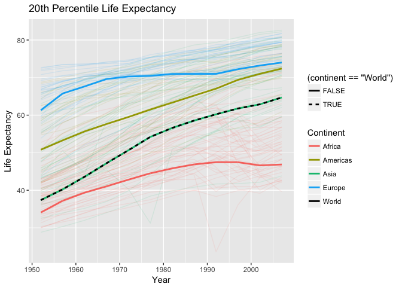
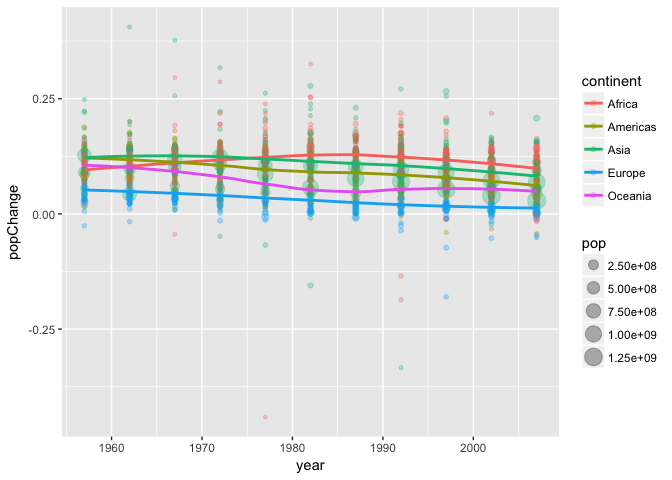
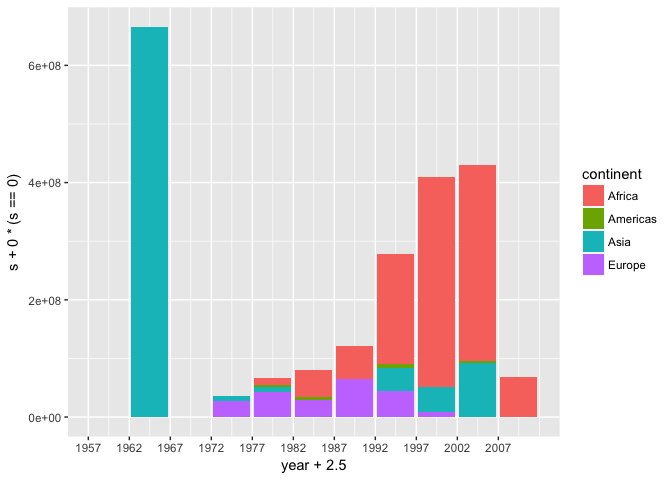
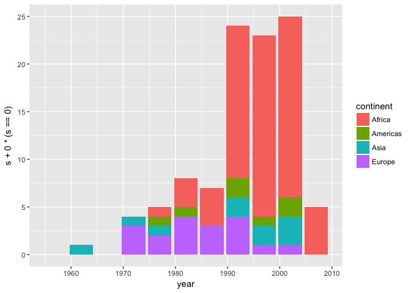

More Gapminder Exploration
================

#### Table of content

-   1 [Installation of packages](#installation_of_packages)

1 Installation of packages
--------------------------

``` r
library(gapminder)
library(tidyverse)
library(scales) 
source('code/Weighted Quantile.R')
```

We will analyse the gapminder dataset using dplyr and ggplot from tidyverse. We will also be using ggplots hue palette obtained from the scales library, and a custom made weighted quantile function. The documentation for the weighted quantiles function can be found in the

Task 1
------

*Report the absolute and/or relative abundance of countries with low life expectancy over time by continent: Compute some measure of worldwide life expectancy – you decide – a mean or median or some other quantile or perhaps your current age. Then determine how many countries on each continent have a life expectancy less than this benchmark, for each year.*

Let's calculate the life 10% percentile life expectancy for the world. To do this, we cannot simly use R's quantile function, as we need weighted quantiles

problem 1: computes the quantile for the first year, and uses that year as the quantile for all years

1.1 20th Percentile Life Expectancy
-----------------------------------

First of all, lets manipulate the data, and add a field for the 20th percentile for life expectation. As the population of each country varies a lot, the percentile is weighted with the population. Click [here](code/Weighted_Quantile.md) to see how the weighted quantiles are computed. This is a bit technical, but we use the 20th percentile life expectancy with the following definition

*The 20th percentile life expectancy **q**, is such that 10 percent of the continent's population lives in a country with a lower or equal life expectancy than **q**, and 90 percent of the continent's population lives in a country with a higher or equal life expectancy than **q**. *

``` r
# Start with the gapminder dataset
gapminder.without.Oceania <- gapminder %>% 
  
# filter out Oceania as we don't have enough observations for computing quantiles
  filter(continent != 'Oceania') %>% 
  
# continent is a factor variable, and droplevels() makes sure that Oceania is removed as an option
  droplevels()                       
```

``` r
# compute the 20th percentile life expectancy for the world for each year
dat.world <- gapminder.without.Oceania %>%
  group_by(year) %>% 
  mutate(lifeExp.20 = weighted.quantile(lifeExp, weight=as.numeric(pop), probs=0.2))
```

``` r
# compute the 20th percentile life exp for each continent and each year
dat <- gapminder.without.Oceania %>% 
  group_by(continent, year)      %>% 
  mutate(lifeExp.20 = weighted.quantile(lifeExp, weight=as.numeric(pop), probs=0.2)) %>% 
              
# and add the world's 20th percentile life expectancy to the data
  ungroup() %>%     
  add_row(continent='World', year=dat.world$year, lifeExp.20=dat.world$lifeExp.20)
```

We use kable to display the data we just created

``` r
dat %>% 

# calculate the mean of the 20th percentile life exp for each continent and each year
  with(tapply(lifeExp.20, list(continent, year), mean)) %>% 
  
# and present the data
  knitr::kable()
```

|          |    1952|    1957|    1962|    1967|    1972|    1977|    1982|    1987|    1992|    1997|    2002|    2007|
|----------|-------:|-------:|-------:|-------:|-------:|-------:|-------:|-------:|-------:|-------:|-------:|-------:|
| Africa   |  34.078|  37.207|  39.360|  41.040|  42.821|  44.514|  45.826|  46.886|  47.472|  47.464|  46.608|  46.859|
| Americas |  50.789|  53.285|  55.665|  57.632|  59.504|  61.489|  63.336|  65.205|  67.057|  69.388|  71.006|  72.390|
| Asia     |  37.373|  40.249|  43.605|  47.193|  50.651|  54.208|  56.596|  58.553|  60.223|  61.765|  62.879|  64.698|
| Europe   |  61.310|  65.770|  67.640|  69.610|  70.290|  70.450|  70.960|  70.980|  70.990|  72.232|  73.213|  74.002|
| World    |  37.373|  40.249|  43.605|  47.193|  50.651|  54.208|  56.596|  58.553|  60.223|  61.765|  62.879|  64.698|

And this data is plotted, together with the life expectancy for each country.

``` r
# start with our already filtered data
dat %>% 
  ggplot(aes(x=year, color=continent)) + 
  geom_line(aes(y=lifeExp,group=country),
            alpha=0.1) + 
  
# add a separate line style to the "world" data
  geom_line(size=1,
            aes(y=lifeExp.20, 
                linetype=(continent=='World'))) + 

# add color with equal chroma=65, luma=100 but different hue for the continents,
# and black color for the world
  scale_color_manual(values=c(hcl(h=15+seq(0,3)*360/5,c=100,l=65), 'black')) +
  
# add title and axis labels
  labs(title='20th Percentile Life Expectancy', x='Year', y='Life Expectancy') 
```



Two observations. First, notice that after 1987, the 20th percentile life expectancy in Africa drops. This does not follow the rest of the world's trend, but can be explained by the outbreak of HIV and Aids. In addition, ovserve that almost all countries lower than the world's 20th percentile life expectation are African.

<https://stackoverflow.com/questions/6999144/how-do-you-create-a-bar-plot-for-two-variables-mirrored-across-the-x-axis-in-r> <https://stackoverflow.com/questions/13734368/ggplot2-and-a-stacked-bar-chart-with-negative-values>

``` r
dat %>% 
  group_by(year,continent) %>% 
  mutate(pop = pop/sum(as.numeric(pop))) %>% 
  group_by(year) %>% 
  mutate(pop.over  = pop*(lifeExp>=lifeExp.20[continent=='World']),
         pop.under = pop*(lifeExp< lifeExp.20[continent=='World'])) %>% 
  filter(continent != 'World') %>% 
  group_by(year,continent) %>%
  summarize(pop.under = sum(pop.under), pop.over = sum(pop.over)) %>% 
  
  ggplot(aes(x=factor(year))) +
  geom_bar(aes(y=pop.under, group=continent, fill=continent), stat='identity', position='stack')
```


``` r
dat %>% 
  group_by(year,continent) %>% 
  mutate(pop = pop/sum(as.numeric(pop))) %>% 
  group_by(year) %>% 
  mutate(pop.over  = pop*(lifeExp>=lifeExp.20[continent=='World']),
         pop.under = pop*(lifeExp< lifeExp.20[continent=='World'])) %>% 
  filter(continent != 'World')
```

    ## # A tibble: 1,680 x 9
    ## # Groups:   year [12]
    ##        country continent  year lifeExp         pop gdpPercap lifeExp.20
    ##         <fctr>    <fctr> <int>   <dbl>       <dbl>     <dbl>      <dbl>
    ##  1 Afghanistan      Asia  1952  28.801 0.006038118  779.4453     37.373
    ##  2 Afghanistan      Asia  1957  30.332 0.005913136  820.8530     40.249
    ##  3 Afghanistan      Asia  1962  31.997 0.006052430  853.1007     43.605
    ##  4 Afghanistan      Asia  1967  34.020 0.006054568  836.1971     47.193
    ##  5 Afghanistan      Asia  1972  36.088 0.006080720  739.9811     50.651
    ##  6 Afghanistan      Asia  1977  38.438 0.006240422  786.1134     54.208
    ##  7 Afghanistan      Asia  1982  39.854 0.004935305  978.0114     56.596
    ##  8 Afghanistan      Asia  1987  40.822 0.004829986  852.3959     58.553
    ##  9 Afghanistan      Asia  1992  41.674 0.005207916  649.3414     60.223
    ## 10 Afghanistan      Asia  1997  41.763 0.006569772  635.3414     61.765
    ## # ... with 1,670 more rows, and 2 more variables: pop.over <dbl>,
    ## #   pop.under <dbl>

``` r
gapminder %>% 
  mutate(lifeExpChange = lifeExp - lag(lifeExp,1),
         didDecrease = pop*(lifeExpChange<0)) %>% 
  filter(year != min(year)) %>% 
  group_by(continent, year) %>% 
  summarize(s=sum(didDecrease)) %>% 
  ggplot(aes(x=year+2.5, y=s+0.0*(s==0), fill=continent)) + 
  geom_histogram(stat='identity', position='stack') +
  scale_x_continuous(breaks=seq(1952,2007,5))
```

    ## Warning: Ignoring unknown parameters: binwidth, bins, pad



``` r
gapminder %>% 
  mutate(lifeExpChange = lifeExp - lag(lifeExp,1),
         didDecrease = lifeExpChange<0) %>% 
  filter(year != min(year)) %>% 
  group_by(continent, year) %>% 
  summarize(s=sum(didDecrease)) %>% 
  ggplot(aes(x=year, y=s+0.0*(s==0), fill=continent)) + 
  geom_histogram(stat='identity', position='stack')
```

    ## Warning: Ignoring unknown parameters: binwidth, bins, pad


``` r
gapminder %>% 
  mutate(relativePopChange = (pop - lag(pop,1))/pop) %>% 
  filter(year != min(year), abs(relativePopChange) < 0.25) %>% 
  group_by(continent, year) %>% 
  ggplot(aes(x=year, y=relativePopChange, color=continent)) + 
  geom_point(alpha=0.3, aes(size=pop))
```



``` r
gapminder %>% 
  filter(continent == 'Europe') %>% 
  group_by(year) %>% 
  mutate(pop = pop/sum(pop)) %>% 
  ggplot(aes(x=year, y=lifeExp, group=country, size=pop)) +
  geom_point(alpha=0.5)
```


