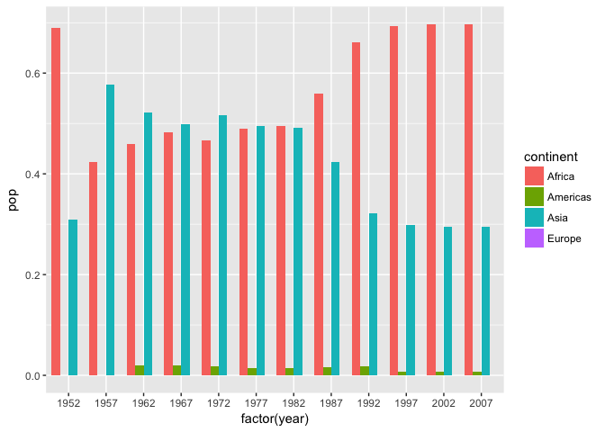
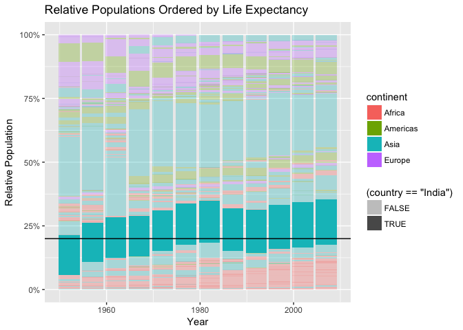
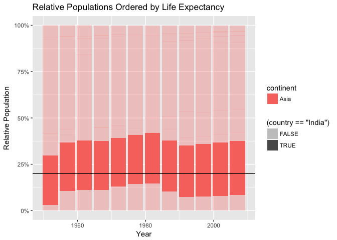
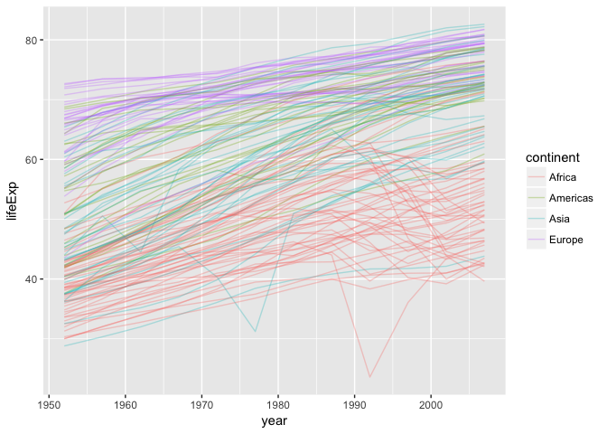

More Gapminder Exploration
================

### Abstract

We are going to explore the gapminder data set included with R. We will use dplyr to manipulate the data, and ggplot to plot it.

#### Table of content

-   [1 Installation of packages](#installation_of_packages)
-   [2 Fun With Data](#fun-with-data)
    -   [2.1 20th Percentile Life Expectancy](#th-percentile-life-expectancy)
        -   [2.1.1 Trends in Life Expectancy](#trends-in-life-expectancy)
        -   [2.1.2 Low Life Expectancy Population Distribution](#low-life-expectancy-population-distribution)
        -   [2.1.3 Asia and the World](#asia-and-the-world)
    -   [2.2 Story Telling](#story-telling)

1 Installation of packages
--------------------------

``` r
library(gapminder)
library(tidyverse)
library(scales) 
source('../code/Weighted Quantile.R')
```

2 Fun with Data
---------------

[*Back to the top*](#abstract)

Let's have some fune with the gapminder data.

### 2.1 20th Percentile Life Expectancy

[*Back to the top*](#abstract)

We will judge the life expectancy for each country as the 20th percentile. The *20th* percentile is a number taken out of thin air, but if 80% of the population has a good life expectancy, the continent is in overall good shape. So first of all, lets manipulate the data, and add a field for the 20th percentile for life expectation (abbreviated 20th percentile from now on). As the population of each country varies a lot, the percentile is weighted with the population. Click [here](Weighted_Quantile.md) to see how the weighted quantiles are computed. This is a bit technical, but we use the 20th percentile with the following definition

> The 20th percentile *q*, is such that 20 percent of the continent's population lives in a country with a lower or equal life expectancy than *q*, and 80 percent of the continent's population lives in a country with a higher or equal life expectancy than *q*.

We remove Oceania from the dataset as it's not contructive to calculate percentiles based on only two observations.

``` r
# Start with the gapminder dataset
gapminder <- gapminder %>% 
  
# filter out Oceania as we don't have enough observations for computing quantiles
  filter(continent != 'Oceania') %>% 
  
# continent is a factor variable, and droplevels() makes sure that Oceania is removed as an option
  droplevels()                       
```

``` r
# compute the 20th percentile for each continent and each year
percentile.data <- gapminder %>% 
  group_by(continent, year)      %>% 
  summarize(lifeExp = weighted.quantile(lifeExp, weight=as.numeric(pop), probs=0.2)) %>% 
  
# and add the world's 20th percentile to the data  
  full_join(gapminder %>%
              group_by(year) %>% 
              summarize(continent = 'World', 
                        lifeExp = weighted.quantile(lifeExp, weight=as.numeric(pop), probs=0.2)))
```

#### 2.1.1 Trends in life expectancy

[*Back to the top*](#abstract)

Aim of the section:

> How is life expectancy changing over time on different continents?

We use `spread()` and `kable()` to make a table of the 20th percentiles for the different continents, and the world.

``` r
percentile.data %>% 
  
# spread the 20th percentile on a table with continent rows and year columns
  spread(key=year, value=lifeExp) %>% 
  
# and present the data
  knitr::kable(digits=1)
```

| continent |  1952|  1957|  1962|  1967|  1972|  1977|  1982|  1987|  1992|  1997|  2002|  2007|
|:----------|-----:|-----:|-----:|-----:|-----:|-----:|-----:|-----:|-----:|-----:|-----:|-----:|
| Africa    |  34.1|  37.2|  39.4|  41.0|  42.8|  44.5|  45.8|  46.9|  47.5|  47.5|  46.6|  46.9|
| Americas  |  50.8|  53.3|  55.7|  57.6|  59.5|  61.5|  63.3|  65.2|  67.1|  69.4|  71.0|  72.4|
| Asia      |  37.4|  40.2|  43.6|  47.2|  50.7|  54.2|  56.6|  58.6|  60.2|  61.8|  62.9|  64.7|
| Europe    |  61.3|  65.8|  67.6|  69.6|  70.3|  70.5|  71.0|  71.0|  71.0|  72.2|  73.2|  74.0|
| World     |  37.4|  40.2|  43.6|  47.2|  50.7|  54.2|  56.6|  58.6|  60.2|  61.8|  62.9|  64.7|

And this data is plotted, together with the life expectancy for each country.

``` r
# plot the life expectancy for each year
ggplot(gapminder,aes(x=year, y=lifeExp, color=continent)) + 
  geom_line(alpha=0.1,
            aes(group=country)) +

# add the continent wise 20th precentile
  geom_line(data=percentile.data,
            size=1,
            aes(linetype=(continent=='World'))) + 

# add color with chroma=65, luma=100 but different hue for the different continents, and black color for the world
  scale_color_manual(values=c(hcl(h=15+seq(0,3)*360/5,c=100,l=65), 'black'), 'Continent') +
  
# add title and axis labels
  labs(title='20th Percentile Life Expectancy', x='Year', y='Life Expectancy')
```


First, lets take a look at the trends. Notice that the Americas', Asia's and the world's 20th percentile is increasing during the whole time period. On the other hand, Africa and Europe has time periods where the 20th percentile is not increasing. For africa, it's likely to assume that the stall is due to the outbreak of HIV and Aids in the 90s. For Europe, it's not obvious for me why the increase stopped in the 70s, 80s and 90s.

#### 2.1.2 Low life expectancy population distribution

[*Back to the top*](#abstract)

Aim of the section:

> For each continent, what proportion of the population lives in a country with a lower life expectancy then the world's 20th percentile life expectancy. (variation of the report on the abundance task)

From the above plot, it would seem like most of the population living with a life expectancy lower than the 20th percentile, lives in Africa. However, this is just a speculation. We need numbers. The following code computes where the population with low life expectancy lives, as a distribution over the continents.

``` r
# Start with the original data
worse.life.exp <- 
  gapminder %>% 
  
# add the world's 20th percentile life expectancy
  full_join(percentile.data) %>% 

# map all populations for contries where the life expectancy is higher than the worlds 20th percentile, to 0
  group_by(year) %>% 
  mutate(pop = pop*(lifeExp < lifeExp[continent=='World'])) %>% 

# normalize the populations
  mutate(pop = pop/sum(as.numeric(pop), na.rm=TRUE)) %>% 

# remove the world continent, and sum all populations with lower life exepctancies than 20th percentile
  filter(continent != 'World') %>% 
  group_by(year,continent) %>%
  summarize(pop = sum(pop, na.rm=TRUE))


# make a table
worse.life.exp %>% 
  group_by(year, continent) %>% 

# convert to percentages
  mutate(pop = paste0(round(100 * sum(pop, na.rm=TRUE), 0), "%")) %>% 
  spread(key=year, value=pop) %>% 
  knitr::kable()
```

| continent | 1952 | 1957 | 1962 | 1967 | 1972 | 1977 | 1982 | 1987 | 1992 | 1997 | 2002 | 2007 |
|:----------|:-----|:-----|:-----|:-----|:-----|:-----|:-----|:-----|:-----|:-----|:-----|:-----|
| Africa    | 69%  | 42%  | 46%  | 48%  | 47%  | 49%  | 50%  | 56%  | 66%  | 69%  | 70%  | 70%  |
| Americas  | 0%   | 0%   | 2%   | 2%   | 2%   | 1%   | 1%   | 2%   | 2%   | 1%   | 1%   | 1%   |
| Asia      | 31%  | 58%  | 52%  | 50%  | 52%  | 50%  | 49%  | 42%  | 32%  | 30%  | 30%  | 30%  |
| Europe    | 0%   | 0%   | 0%   | 0%   | 0%   | 0%   | 0%   | 0%   | 0%   | 0%   | 0%   | 0%   |

``` r
# make a plot
worse.life.exp %>% 
  ggplot(aes(x=factor(year))) +
  geom_bar(aes(y=pop, group=continent, fill=continent), stat='identity', position='dodge')
```



Indeed, Africa is dominating the low life expectancies. It should here be notet that we only counted those countries with *strictly* lower life expectancies than the 20th percentile. As we will see in the next section, India's life expectancy is equal to the world's 20th percentile. If we counted countries with *weakly* lower life expectancies, Asia would dominate.

#### 2.1.3 Asia and the World

[*Back to the top*](#abstract)

Aim of the section

> Try to answer why Asia and the world have the same 20th percentile. (my own task)

Going back to the first plot, notice how the 20th percentile is the very same for Asia and for the World. This cannot be coincidental. The 20th percentile is defined on a non-interpolating manner, so each 20th percentile belongs to the life expectancy of a *single* country. Therefore it's natural to consider the largest countries in Asia. Let's compute the relative populations of all countries, arrange them by life expectancy, and make a stacked histogram with size proportional to population. We'll also highlight India.

``` r
# Color by continent, highlight India and order by increasing life expectancy
gapminder %>% 
  ggplot(aes(x = year,
             y = pop,
             fill = continent,
             alpha = (country=='India'),
             group = -lifeExp)) +
  scale_alpha_manual(values=c(0.3,1)) +

# add histobram
  geom_bar(stat = 'identity', position='fill') +

# add 20th percentile
  geom_hline(yintercept=0.2) +
  
# and graphical preferences
  labs(x = 'Year',
       y = 'Relative Population',
       title = 'Relative Populations Ordered by Life Expectancy') +
  scale_y_continuous(breaks=seq(0,1,0.25),
                   labels=paste0(seq(0,100,25),'%'))
```



We also included a marker for the 20th percentile. Lets also compute the life upper and lower limits for the *India block* in the plot above

``` r
gapminder %>% 
  group_by(year) %>% 
  mutate(pop = pop/sum(as.numeric(pop))) %>% 

# compute the total weight of population with lower life expectancy than India,
# and with STRICTLY lower life expectancy than India
  summarize(Lower = sum(pop*(lifeExp< lifeExp[country=='India'])),
            Upper = sum(pop*(lifeExp<=lifeExp[country=='India']))) %>% 

# convert to percentages
  mutate(Lower = paste0(round(100*Lower, 1), "%"),
         Upper = paste0(round(100*Upper, 1), "%")) %>% 
  knitr::kable(digits=3)
```

|  year| Lower | Upper |
|-----:|:------|:------|
|  1952| 5.7%  | 21.3% |
|  1957| 10.9% | 26.3% |
|  1962| 12.6% | 28.3% |
|  1967| 13.1% | 28.9% |
|  1972| 15.1% | 31%   |
|  1977| 17.5% | 33.7% |
|  1982| 18.3% | 34.9% |
|  1987| 15.1% | 31.9% |
|  1992| 14.2% | 31.4% |
|  1997| 15.9% | 33.3% |
|  2002| 16.6% | 34.3% |
|  2007| 17.6% | 35.4% |

As we can see, the 20th percentile always falls between India's upper and lower limit for the quantile life expectancy. Let's do the same, except only for the Asian countries.

``` r
# Color by continent, highlight India and order by increasing life expectancy
gapminder %>% 
  filter(continent == 'Asia') %>% 
  ggplot(aes(x = year,
             y = pop,
             fill = continent,
             alpha = (country=='India'),
             group = -lifeExp)) +
  scale_alpha_manual(values=c(0.3,1)) +

# add histobram
  geom_bar(stat = 'identity', position='fill') +

# add 20th percentile
  geom_hline(yintercept=0.2) +
  
# and graphical preferences
  labs(x = 'Year',
       y = 'Relative Population',
       title = 'Relative Populations Ordered by Life Expectancy') +
  scale_y_continuous(breaks=seq(0,1,0.25),
                   labels=paste0(seq(0,100,25),'%'))
```



``` r
gapminder %>% 
  group_by(year) %>% 
  mutate(pop = pop/sum(as.numeric(pop))) %>% 

# compute the total weight of population with lower life expectancy than India,
# and with STRICTLY lower life expectancy than India
  summarize(Lower = sum(pop*(lifeExp< lifeExp[country=='India'])),
            Upper = sum(pop*(lifeExp<=lifeExp[country=='India']))) %>% 

# convert to percentages
  mutate(Lower = paste0(round(100*Lower, 1), "%"),
         Upper = paste0(round(100*Upper, 1), "%")) %>% 
  knitr::kable(digits=3)
```

|  year| Lower | Upper |
|-----:|:------|:------|
|  1952| 5.7%  | 21.3% |
|  1957| 10.9% | 26.3% |
|  1962| 12.6% | 28.3% |
|  1967| 13.1% | 28.9% |
|  1972| 15.1% | 31%   |
|  1977| 17.5% | 33.7% |
|  1982| 18.3% | 34.9% |
|  1987| 15.1% | 31.9% |
|  1992| 14.2% | 31.4% |
|  1997| 15.9% | 33.3% |
|  2002| 16.6% | 34.3% |
|  2007| 17.6% | 35.4% |

Both the World's and Asia's 20th percentiles corresponds to India, confirming that the two percentiles are the same.

### 2.2 Story Telling

[*Back to the top*](#abstract)

Aim for this section:

> Find countries with interesting stories. Open-ended and, therefore, hard. Promising but unsuccessful attempts are encouraged. This will generate interesting questions to follow up on in class.

Lets revisit the first plot, but now let's only focus on the life expectancy for each country.

``` r
ggplot(gapminder,aes(x=year, y=lifeExp, color=continent)) + 
  geom_line(alpha=0.3,
            aes(group=country))
```



Notice that in 1977 and 1992, there are outliers with very low life expectancies. Let's try to find out which countries these are.

``` r
# extract the countries with the minimum life expectancy for years 1977 and 1992
gapminder %>%
  group_by(year) %>% 
  filter(year %in% c(1977, 1992),
         lifeExp == min(lifeExp)) %>%
  summarize(Country = country) %>% 
  knitr::kable()
```

|  year| Country  |
|-----:|:---------|
|  1977| Cambodia |
|  1992| Rwanda   |

Sadly enough, these datas matches the genosides in Cambodia and Rwanda in given time spans quite well.
